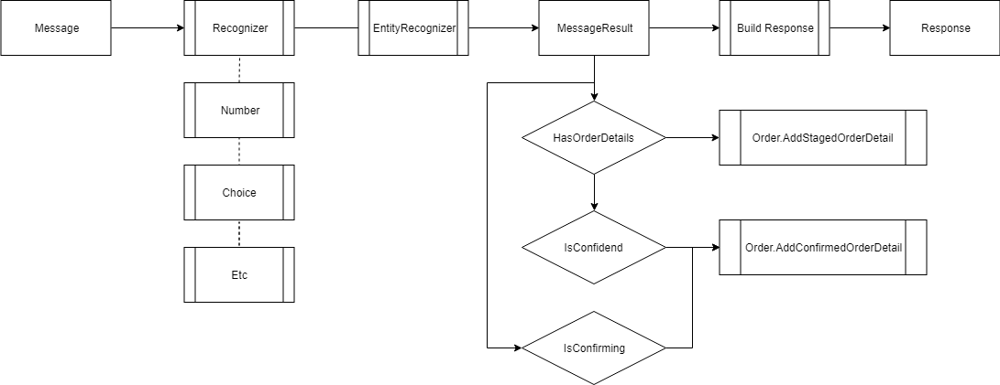

# RubberDuckyLabs

Why Rubberducky? As developers our best friend is the rubber ducky. He, She, It is always there to listen. Listen to how your new lines of code work. With the effort to rethink why? 

The aim of this study group is to pass for Microsoft's 70-483 certificate. What better way then to challenge ourselves with a shared use case. Together we explore, learn, gain confidence all contribute to acing the exam. Rubberducky will help us to comprehend.

## Install

1. Download the zipped project.
2. Unzip the project.
3. Run the RubberDucky!

## Introduction

In the labs the aim is to mimic multiple ordering scenario's with a waitress. As base to recognize a [nuget package, Microsoft.Recognizer.Text](https://github.com/Microsoft/Recognizers-Text) is used. In further steps a [LUIS service](https://eu.luis.ai/home) is provided to handle complex recognitions like intentions and possible entity locations.

A simple template will be provided to get a basic functionality to jump start a conversation. The image below shows the current flow. But it lacks conversation finesse.

## Lab 1 Task and Threading

### 1.1 Increase Performance
Within the code there are multiple oppertunities to implement parrallel tasks or threads to increase performance.
Most of them will be indicated as comment within the code. Feel free to spot other oppertunities increase performance.

### 1.2 Create a natural response when ordering
#### 1.2.1 Response construction
A typical reply by humans will contain an Acknowledgement, Implicit confirmation and a Prompt. Like respectivly in the following example:

C: Can I have a beer?

W: Sure, we have a lot of beers. What can I serve?

Find a 

#### 1.2.2. Delay time
To make the response more natural a small delay is desirable. 
Find a way to implement this with the use of Tasks or Threads.

### 1.3 Ask for more information about product.
It can occur that you would like to know more about a certain product. 
Ask the waitress for it. She will google it for you (takes her about 20 seconds) in the meanwhile it is still possible to continue the order.

Good luck!